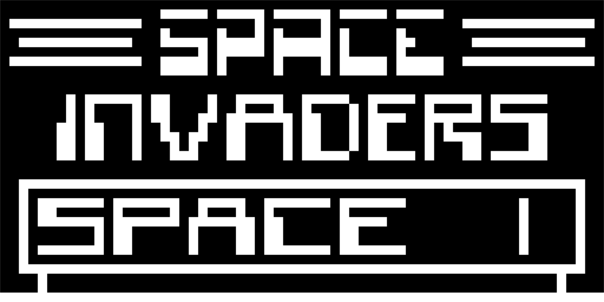

# CHIP-8 Emulator

[](https://travis-ci.com/dominikrys/chip8)
[](https://dominikrys.com/chip8/)
[](https://opensource.org/licenses/MIT)
[](https://github.com/dominikrys/chip8/releases)

A CHIP-8 emulator written in C++17. SDL2 is used for sound, graphics and input. The goal of this project was to learn about software emulation, setting up CI pipelines and compiling to WebAssembly.

[**Compiled to WebAssembly and hosted on the web**](http://dominikrys.com/chip-8).

Compiled Linux binaries available under [releases](https://github.com/dominikrys/chip8/releases).

_CHIP-8 is an interpreted programming language developed by Joseph Weisbecker in the 1970s. It was made to allow video games to be more easily programmed for 8-bit microcomputers at the time, and runs on a CHIP-8 virtual machine._

## Screenshots

|                      |          |
| :--------------------------------------------: | :------------------------------------: |
|  |  |

## Building

### Dependencies

- **C++17 compiler**

  - **Linux:** GCC 9. Can be obtained by installing `g++-9` from the `ubuntu-toolchain-r/test` PPA repo.
  - **Windows:** MinGW-w64 8.0 (GCC 9.2). Can be obtained through MSYS2 by installing the `mingw-w64-x86_64-gcc` pacman package after updating MSYS2 with `pacman -Syu`. To run, download the [SDL2 runtime binaries](https://www.libsdl.org/download-2.0.php) and put SDL2.dll into the folder with your compiled binary

- **SDL2**

  - **Linux:** get SDL2 by running `sudo apt install libsdl2-dev`.
  - **Windows:** download the [SDL2-2.0.10 development libraries](https://www.libsdl.org/download-2.0.php) and place them under a new "external" folder in the root directory of this project.

- **CMake 3.10**

  - **Linux:** can be obtained from the `ubuntu-toolchain-r/test` PPA repo or from the [Kitware apt repo](https://apt.kitware.com/).
  - **Windows:** can be downloaded from [here](https://cmake.org/download/).

- **Emscripten 1.39.17 _(required for WebAssembly output only)_**
  - Download [here](https://emscripten.org/docs/getting_started/downloads.html).

### Compiling

#### Native
Run the following from the source directory:

##### Windows

```console
cmake.exe . -B <output dir> -DCMAKE_BUILD_TYPE=Debug -G "CodeBlocks - MinGW Makefiles"`
cmake.exe --build <output dir>`  
```
  
##### Linux

```bash
$ cmake . -B <output dir> -DCMAKE_BUILD_TYPE=Debug -G "CodeBlocks - Unix Makefiles"
$ cmake --build <output dir>
```

#### WebAssembly

##### Windows
- Navigate to your `emsdk` directory and install Emscripten using the command line: `emsdk install latest`
- Activate Emscripten: `emsdk activate latest`
- Install mingw32-make: `emsdk install mingw-7.1.0-64bit`
- Navigate to a sub-directory in this repo to where CMake files will be generated to (e.g. `chip8/cmake-build-emscripten`)
- Run `emcmake cmake -G "CodeBlocks - MinGW Makefiles" .. -DCMAKE_SH="CMAKE_SH-NOTFOUND" && mingw32-make`
- The files have been output to `chip8/web` directory. To run, host the `web` directory using e.g. `python3 -m http.server` and access `http://localhost:8000/` locally.

##### Linux
- Navigate to your `emsdk` directory and install Emscripten using the terminal: `./emsdk install latest`
- Activate Emscripten: `./emsdk activate latest`
- Navigate to a sub-directory in this repo to where CMake files will be generated to (e.g. `chip8/cmake-build-emscripten`)
- Run `emcmake cmake -G "CodeBlocks - Unix Makefiles" .. && make`
- The files have been output to `chip8/web` directory. To run, host the `web` directory using e.g. `python3 -m http.server` and access `http://localhost:8000/` locally.

## Usage

**Linux**: `./chip_8 --rom <path> [options]`

**Windows**: `chip_8.exe --rom <path> [options]`

- For more help, including displaying the available options, run: `chip_8.exe --help`

- Some ROMs are provided in the /bin/roms directory.

- If audio is not working, set the `SDL_AUDIODRIVER` environment variable to an appropriate value mentioned [here](https://wiki.libsdl.org/FAQUsingSDL).

- The CPU speed and operation modes may need to be changed between ROMs to ensure they work as intended. I've included 3 different operation modes due different ROMs relying on different opcode behaviours, depending on the time period and the interpreter they were written for. Explanations can be found in the links section. They are as follows:

  - **CHIP8**: FX55 and FX65 opcodes increment the instruction counter. 8XY6 and 8XYE registers shift the value in VY and store the result in VX.

  - **CHIP-48**: FX55 and FX65 opcodes increment the instruction counter.

  - **SCHIP**: FX55 and FX65 opcodes don't increment the instruction counter (like on the SCHIP). This is what most ROMs expect, and is the default mode. The emulator doesn't actually support SCHIP opcodes (yet?).

## Links

- [Cowgod's Chip-8 Technical Reference v1.0](http://devernay.free.fr/hacks/chip8/C8TECH10.HTM)

- [CHIP-8 on Wikipedia](https://en.wikipedia.org/wiki/CHIP-8)

- [Explanation of differing opcode behaviours on CHIP8/CHIP-48/SCHIP](https://www.reddit.com/r/programming/comments/3ca4ry/writing_a_chip8_interpreteremulator_in_c14_10/csuepjm/)

- [Explanation on FX55 & FX65 opcodes](https://github.com/Chromatophore/HP48-Superchip/blob/master/investigations/quirk_i.md)

- [Explanation of timer speeds](<https://github.com/AfBu/haxe-CHIP-8-emulator/wiki/(Super)CHIP-8-Secrets#speed-of-emulation>)
